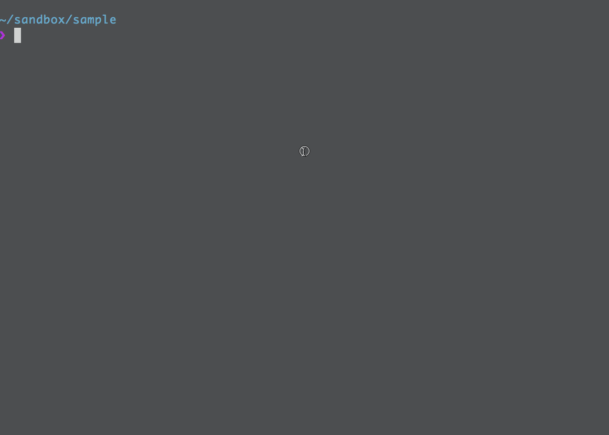

# [](https://github.com/akameco/touch-alt)

[](https://travis-ci.org/akameco/touch-alt)
[](#contributors)

> Create from a template instead of a new file

## Install

```
$ npm install --global touch-alt
```

## Demo



## Usage

```
$ touch-alt --help

  Create from a template instead of a new file

  Usage
  $ touch-alt <source>
  $ touch-alt --add <source>

  Options
  -a, --add         Create new template file
  -o, --overwrite   Overwrite by template

  Example
  $ touch-alt .editorconfig
```

## Example

### Add new template file

```
$ cat .editorconfig
root = true

[*]
indent_style = space
indent_size = 2
end_of_line = lf
charset = utf-8
trim_trailing_whitespace = true
insert_final_newline = true
$ touch-alt --add .editorconfig
```

### Usage

```
# Use touch
$ touch .editorconfig
$ cat .editorconfig

$ rm .editorconfig

# Use touch-alt
$ touch-alt .editorconfig
$ cat .editorconfig
root = true

[*]
indent_style = space
indent_size = 2
end_of_line = lf
charset = utf-8
trim_trailing_whitespace = true
insert_final_newline = true
```

## Tip

Add `alias touch=touch-alt` to your .zshrc/.bashrc to reduce typing & create file easily.

## Contributors

Thanks goes to these wonderful people ([emoji key](https://github.com/kentcdodds/all-contributors#emoji-key)):

<!-- ALL-CONTRIBUTORS-LIST:START - Do not remove or modify this section -->

<!-- prettier-ignore -->
| [<br /><sub><b>akameco</b></sub>](http://akameco.github.io)<br />[💻](https://github.com/akameco/touch-alt/commits?author=akameco "Code") [📖](https://github.com/akameco/touch-alt/commits?author=akameco "Documentation") [⚠️](https://github.com/akameco/touch-alt/commits?author=akameco "Tests") [🚇](#infra-akameco "Infrastructure (Hosting, Build-Tools, etc)") |
| :---: |

<!-- ALL-CONTRIBUTORS-LIST:END -->

This project follows the [all-contributors](https://github.com/kentcdodds/all-contributors) specification. Contributions of any kind welcome!

## License

MIT © [akameco](http://akameco.github.io)
